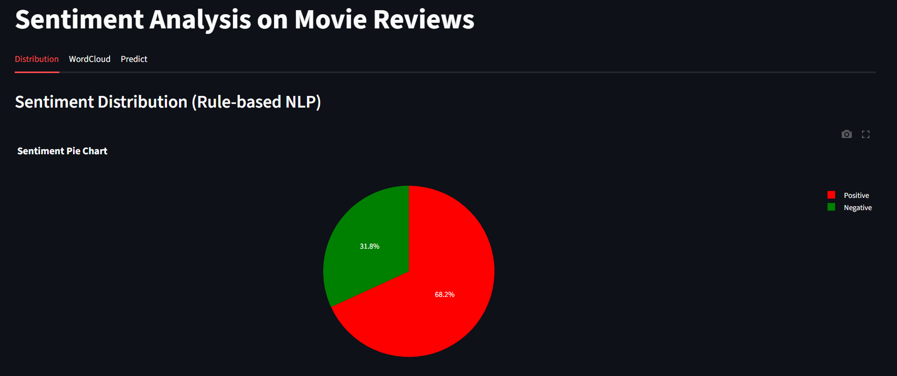
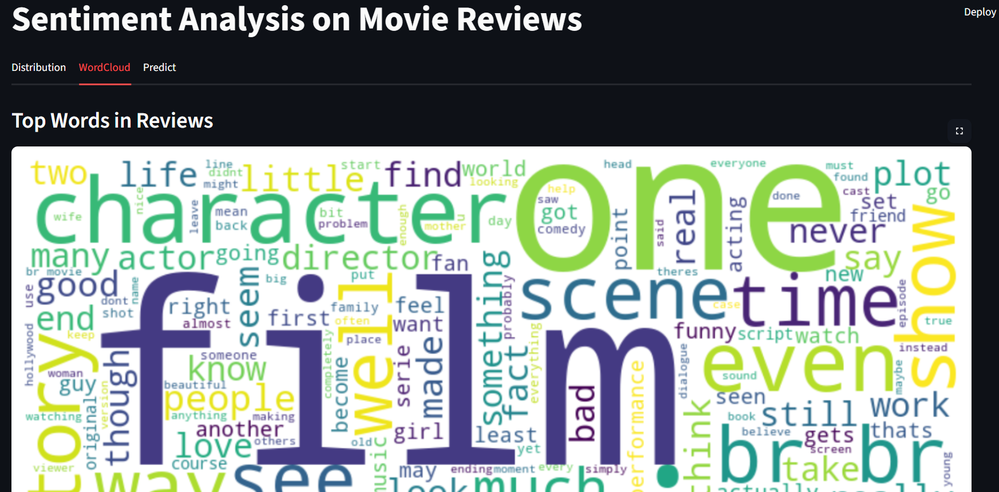

#  Sentiment Analysis on Movie Reviews

This project performs sentiment analysis on a dataset of movie reviews using Natural Language Processing (NLP). It includes both a machine learning approach (Logistic Regression) and a rule-based sentiment analyzer (VADER), along with an interactive Streamlit dashboard for user testing and visualization.

---

##  Objective

To build a system that can classify movie reviews into positive or negative sentiments using:
- Text preprocessing
- TF-IDF feature extraction
- Logistic Regression model
- Rule-based VADER analyzer for comparison
- Streamlit dashboard for live user interaction

---

##  Folder Structure

project/
│
├── app/
│   └── dashboard.py               # Streamlit UI using VADER-based sentiment
│
├── data/
│   ├── MovieReview-Dataset.csv   # Raw review data
│   └── cleaned_reviews.csv       # Preprocessed reviews with labels
│
├── models/
│   ├── logistic_model.pkl        # Trained Logistic Regression model
│   └── tfidf_vectorizer.pkl      # Saved TF-IDF vectorizer
│
├── utils/
│   ├── text_preprocessing.py     # Custom text cleaning functions
│   ├── sentiment_predictor.py    # Rule-based VADER sentiment function
│   └── __init__.py               # Module init file
│
├── main.py                       # Trains and saves ML model and vectorizer
├── requirements.txt              # List of dependencies
└── README.md                     # Project documentation

---

##  How to Run the Project

### 1. Clone the Repository

bash
git clone https://github.com/your-username/sentiment-analysis-movie-reviews.git
cd sentiment-analysis-movie-reviews

### 2. Install Required Libraries

bash
pip install -r requirements.txt

### 3. Run the Model Training Script

bash
python main.py

This will:
- Preprocess the review text
- Train a Logistic Regression model using TF-IDF features
- Evaluate and print accuracy and classification report
- Save the trained model and vectorizer to the models/ folder

### 4. Launch the Streamlit Dashboard

bash
streamlit run app/dashboard.py

This dashboard lets you:
- View sentiment distribution using VADER
- Generate a word cloud from reviews
- Enter your own review and get real-time sentiment feedback

---

##  Methodology

- Used NLTK for text preprocessing (tokenization, stopword removal)
- Used TF-IDF vectorization to convert text into numeric form
- Trained a Logistic Regression classifier for supervised sentiment analysis
- Integrated NLTK’s VADER for rule-based sentiment prediction
- Built an interactive Streamlit app for visualization and testing

---

##  Features in Dashboard

-  Sentiment distribution chart using VADER
-  Word cloud of top review words
-  Live review box for custom sentiment prediction

---

##  Technologies Stack

- Python  
- NLTK  
- Scikit-learn  
- Pandas, NumPy  
- Matplotlib, WordCloud  
- Streamlit  

---

## **Screenshots**

>Below are Screenshots of the project:

### Piechart-Distribution

### WordCloud

### Prediction

---

##  Author

Raagesh A
M.Tech. (Integrated) - Computer Science and Engineering (Data Science) 
VIT Vellore  

This project was built as part of a hands-on learning initiative in Natural Language Processing and sentiment classification.